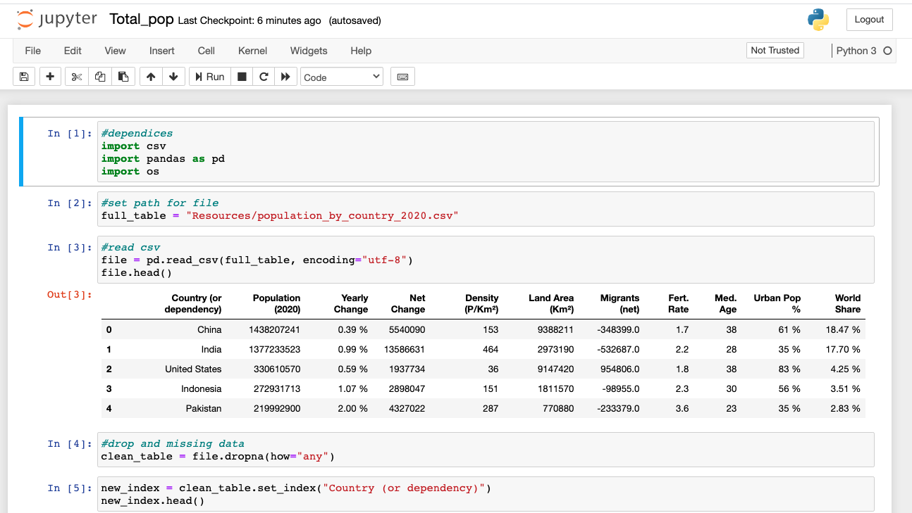
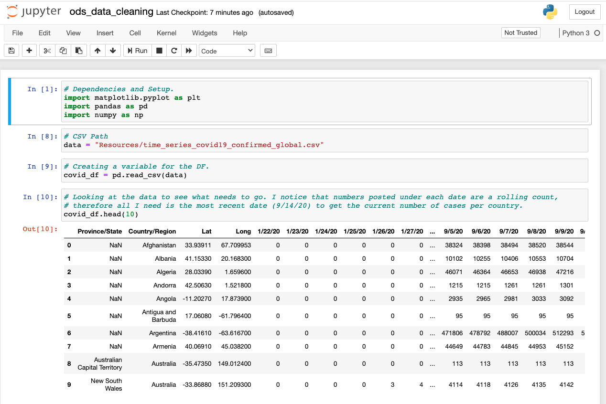
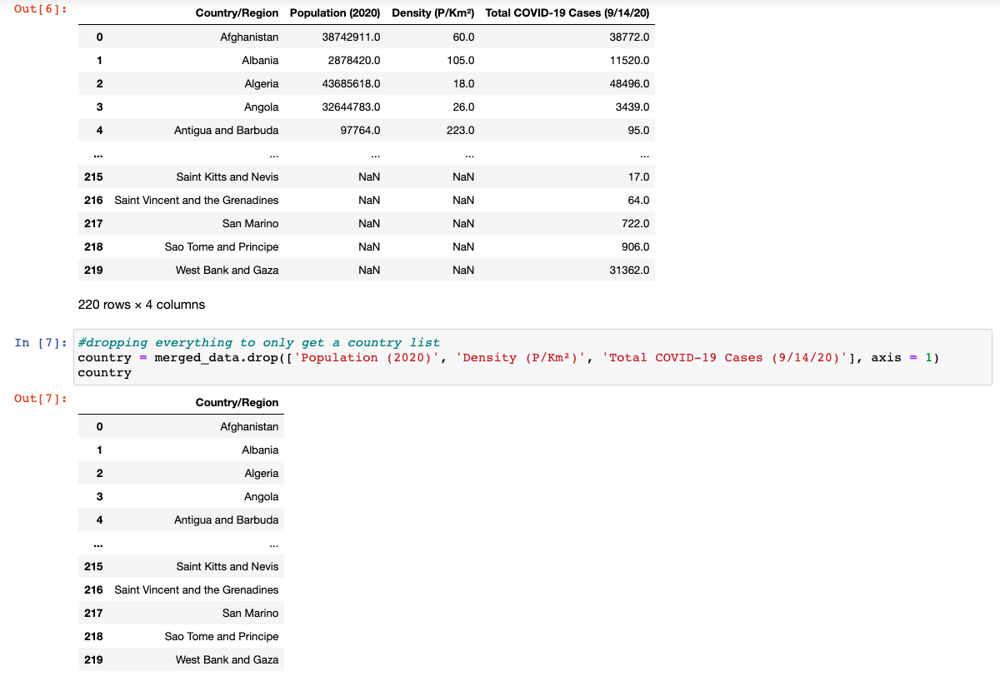
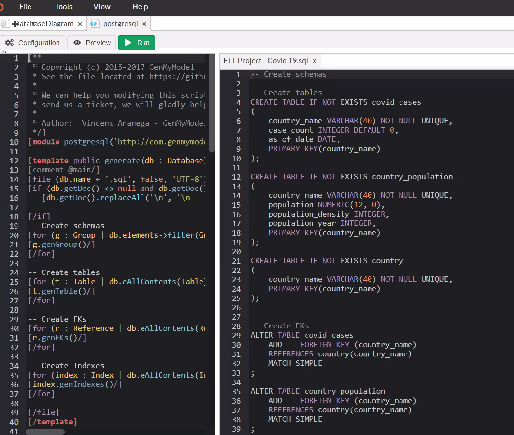
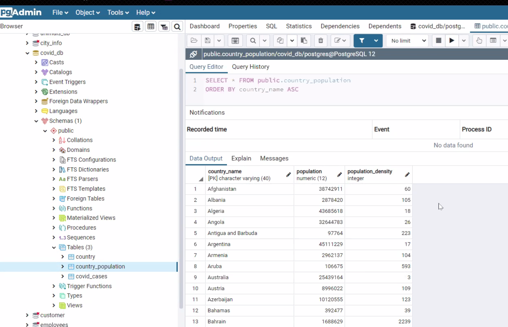

# ETL-Project - Covid 19 vs Country Populations 
:earth_americas: :biohazard: :earth_americas: :biohazard:
## Group - The Bootcamp ## 
Austin, Nick, Rob, Paul

---------------------------------------------------------------
#### Making personal branch (recap):
- clone repo to local
- nav to repo, type in: git checkout -b <your_branch>
- to switch branches: git checkout <branch_name> 
- to upload to repo: git add .  -->  git commit -m "<a descriptive message>" --> git push origin <your_branch>
- Please let Austin know when you've pushed, merging will happen after.
---------------------------------------------------------------

## Data ##
Data Soft – Covid-19 Pandemic -Worldwide can be exported by CSV, JSON, or Excel. However, extracting the size and amount of data made JSON difficult. We decided to use CSV. Original file contained 186k records.

*"This is the data for the 2019 Novel Coronavirus Visual Dashboard operated by the Johns Hopkins University Center for Systems Science and Engineering (JHU CSSE). Also, Supported by ESRI Living Atlas Team and the Johns Hopkins University Applied Physics Lab (JHU APL)."*

- [Data Soft](https://public.opendatasoft.com/explore/dataset/covid-19-pandemic-worldwide-data/export/?disjunctive.zone&disjunctive.category)

Kaggle - Our second source of data comes from Kaggle: Countries population by year 2020. The file is CSV. Original file contained 235 unique values. 

*"Population in the past, present, and future. Milestones. Global Growth Rate. World population by Region and by Religion. Population Density, Fertility Rate, Median Age, Migrants. All-time population total."*

- [Kaggle](https://www.kaggle.com/eng0mohamed0nabil/population-by-country-2020)
---------------------------------------------------------------

## Data Extraction - Cleanup/Transformation ##

We utilized Pandas in Jupyter Notebook to extract and clean the csv files. Cleaning the data required us to drop unnecessary columns, renaming columns, and dropping Country’s that did not appear in both datasets. We built a junction table that included all countries for our join in postgresql database.

#### Extraction – Step-by-Step Population Extraction: ####
1. Population Extraction
2.	Import dependencies
3.	Set the path for the csv
4.	Read CSV in, encode in utf-8
5.	Drop no populated rows (if there is any)
6.	Drop non-useful columns:
7.	Yearly Change
8.	Net Change
9.	Land Area (Km²)
10.	Migrants (net)
11.	Fert. Rate
12.	Med. Age
13.	Urban Pop %
14.	World Share
15.	Rename “Country (or dependency)” to “Country/Region” to work with another CSV file
16.	Sort “Country/Region” alphabetical, make sure this make this sorted list a new tabl
17.	Write new CSV, Index=False, header=True
#### Extraction – Screenshot 1: Loading Population ####

#### Extraction – Step-by-Step Covid 19 Extraction: ####
1.	Import dependencies
2.	Create CSV Path
3.	Create Dataframe
4.	Drop unwanted columns, keeping Country and setting filter to capture “as of date”
5.	Used a groupby function to create object we can sum to capture duplicate country’s found in original dataset. 
6.	Renamed Columns
7.	Exported DataFrame to .csv.
#### Extraction – Screenshot 2: Loading Covid 19 ####

#### Junction Table #### 
- Joined Covid 19 Data, and Population Data. Dropped all columns except Country.
#### Junction Table - Screenshot #### 

---------------------------------------------------------------
## Creating the Database: Step-by-Step ##
1.	First, we created an ERD to outline our process and to identify Primary Keys and Foreign Keys where we could join our datasets.
 
2.	We then created our DataBase and named our tables and imported the datasets.
 
 

